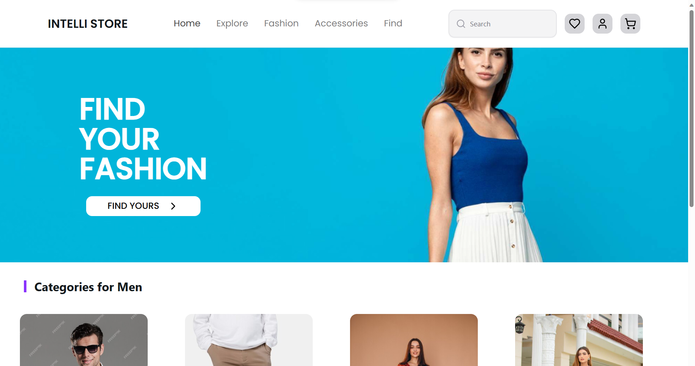

<a href="">
  
  <h1 align="center">Intelli-Store</h1>
</a>
 
<p align="center">
  A web app using Next.js focussing on AI-Powered Products Reccomendations.
</p>
 
<p align="center">
  <a href="#features"><strong>Features</strong></a> ·
  <a href="#model-used"><strong>Model Used</strong></a> ·
  <a href="#running-locally"><strong>Running locally</strong></a> ·
  <a href="#authors"><strong>Authors</strong></a>
</p>
<br/>
 
## Features
 
- Intelli-Store: Seamless Next.js App for E-Commerce.
- AI-Powered Product recommendations: Utilizes LLM's engineered with LangChain, for recommending products.
- Modern UI Design: Stylish UI with Tailwind CSS and lucide Icons.
 
## Model Used
 
This App runs with OpenAI `gpt-3.5-turbo`. We are also trying to develop using langchain and local llm's like Llama for better output generation.
 
## Running locally
 
```bash
npm install
```
 
```bash
npm run dev
```
 
Your app should now be running on [localhost:3000](http://localhost:3000/).
 
## Authors
 
This web-app is created as part of [Code Crypt](https://hackathon.acescusat.in/) Hackathon conducted by Cochin University of Science and Technology, Kochi:
 
- [Abhinand Arun](https://github.com/abhinandarun-02)
- [Arun Govind M](https://github.com/arungovindm2001)
- [Prabath Kini](https://github.com/Prabathkini)
- [Parthasaradhi](https://github.com/ParthasaradhiH)
 